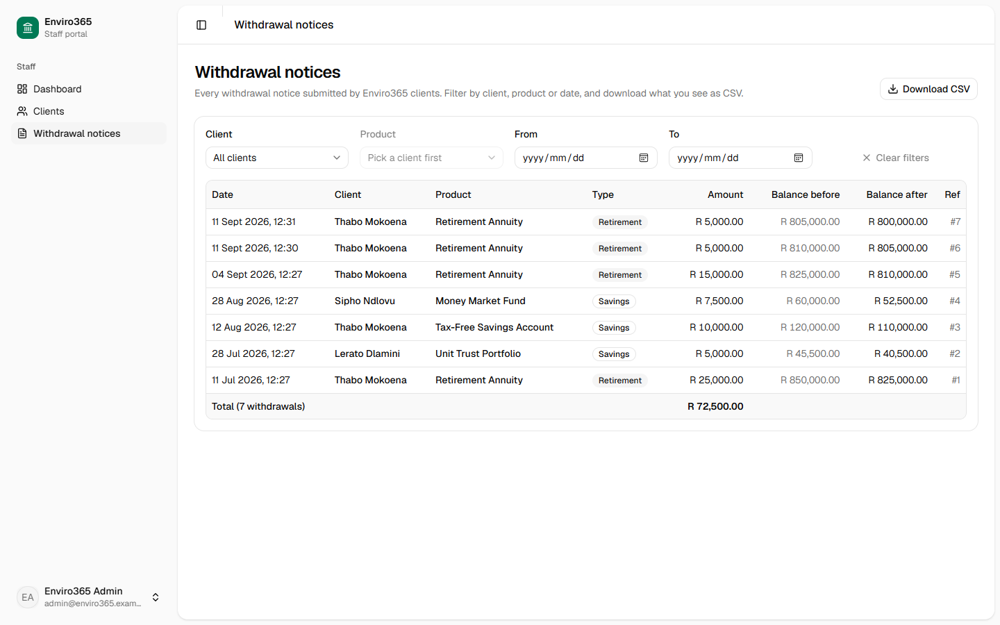
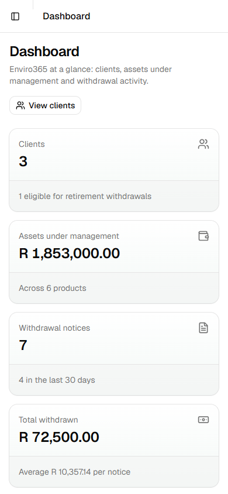
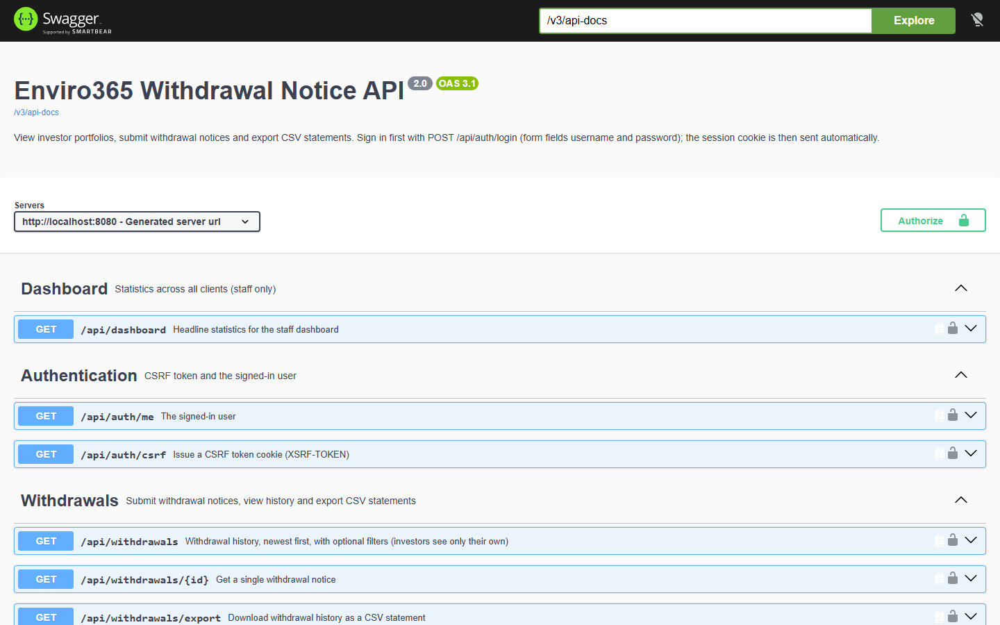

# Enviro365 Withdrawal Notice System

A full-stack application that lets Enviro365 investors **sign in securely**, **view their portfolio**, **submit
withdrawal notices** (validated against the business rules), **review their withdrawal history** and **download CSV
statements**. Investors can only ever see their own data. Enviro365 staff get a read-only staff portal: a dashboard with statistics and charts, a client list, each client's portfolio, and every submitted withdrawal
notice.

| Layer    | Technology |
|----------|------------|
| Backend  | Java 21, Spring Boot 4.1 (Web MVC, Data JPA, Validation, **Security**), H2 in-memory database, springdoc-openapi, Apache Commons CSV |
| Frontend | React 19 + TypeScript, Vite 8, **Tailwind CSS v4 + shadcn/ui** (Radix primitives), React Router 8, TanStack Query 5, Recharts (through shadcn/ui charts), Sonner toasts |
| Quality  | JUnit 5, Mockito, AssertJ, MockMvc + spring-security-test · Vitest · **Spotless** (palantir-java-format) · **ESLint** (typescript-eslint type-checked, React Hooks) · **Prettier** |

Base package: `com.enviro.assessment.junior.smsibi`

---

## Contents

1. [Screenshots](#screenshots)
2. [Getting started](#getting-started)
3. [Security](#security)
4. [API documentation](#api-documentation)
5. [Business rules and assumptions](#business-rules-and-assumptions)
6. [Architecture and design decisions](#architecture-and-design-decisions)
7. [Development standards](#development-standards)
8. [Testing](#testing)
9. [Requirements checklist](#requirements-checklist)
10. [AI usage disclosure](#ai-usage-disclosure)
11. [Possible improvements](#possible-improvements)

---

## Screenshots

| | |
|---|---|
| **Sign-in** (every page requires a session)<br> | **Failed sign-in**: the same generic message for a wrong password or an unknown user<br> |
| **Investor dashboard**<br> | **UI validation**: amount over the balance<br> |
| **Live balance calculation**<br> | **Withdrawal submitted**<br> |
| **History filtered by product, with CSV download**<br> | **Retirement rule**: investor aged 40<br> |
| **Staff: dashboard** (statistics, charts, top clients, latest notices)<br> | **Staff: client list**<br> |
| **Staff: a client's portfolio**<br> | **Staff: all submitted withdrawal notices**<br> |
| **Mobile layout**<br> | **Swagger UI** (dev profile)<br> |

---

## Getting started

### Prerequisites

- **JDK 21+** (Spring Boot 4 needs Java 17 or newer). Maven does **not** need to be installed: the Maven wrapper (`mvnw`) downloads it.
- **Node.js 20.19+** (tested with Node 24) and npm.

### 1. Run the backend (port 8080)

```bash
cd backend
./mvnw spring-boot:run          # Windows: mvnw.cmd spring-boot:run
```

It starts in the **`dev` profile** by default: an in-memory database filled with [demo accounts](#demo-accounts),
plus the H2 console and Swagger UI. Everything is re-created on every start. To run with the developer tools
switched off, use `./mvnw spring-boot:run -Dspring-boot.run.profiles=prod` (the `prod` profile also marks the
session cookie as HTTPS-only).

| URL (dev profile) | What |
|-----|------|
| http://localhost:8080/swagger-ui.html | Interactive API documentation. Sign in through the app first; Swagger then reuses the session and CSRF cookies. |
| http://localhost:8080/v3/api-docs | OpenAPI 3 specification (JSON) |
| http://localhost:8080/h2-console | H2 database console (**staff sign-in required**). JDBC URL `jdbc:h2:mem:enviro`, user `sa`, no password |

### 2. Run the frontend (port 5173)

```bash
cd frontend
npm install
npm run dev
```

Open **http://localhost:5173** and sign in. During development Vite proxies every `/api/*` call to
`http://localhost:8080`, so the browser sees a single origin and the session and CSRF cookies work without any
CORS configuration.

### Demo accounts

Created by [`DataSeeder`](backend/src/main/java/com/enviro/assessment/junior/smsibi/config/DataSeeder.java) in the
`dev` profile only. The password for every account is **`Enviro365!`** (demo data only). The sign-in page also lists
these accounts, but only in development builds.

| Username | Role | Age | What it demonstrates |
|----------|------|-----|----------------------|
| `thabo.mokoena@example.com` | Investor | 70 | Retirement withdrawals allowed |
| `sipho.ndlovu@example.com` | Investor | **65** | Edge case: exactly 65 is **not** eligible (the rule is strictly "older than 65") |
| `lerato.dlamini@example.com` | Investor | 40 | Retirement blocked, savings allowed |
| `admin@enviro365.example` | Staff (`ADMIN`) | n/a | Staff portal: dashboard, client list and portfolios, all withdrawal notices. Read-only: cannot submit withdrawals |

Dates of birth are calculated relative to today, so the ages stay the same whenever the app runs. Five wrong
passwords lock a username for 15 minutes. The lock is held in memory, so restarting the backend clears it.

### Other commands

| Where | Command | Purpose |
|-------|---------|---------|
| `backend/` | `./mvnw test` | Run all 76 backend tests (unit, web-layer and integration) |
| `backend/` | `./mvnw spotless:apply` | Format all Java code (palantir-java-format) |
| `backend/` | `./mvnw verify` | Tests **and** a formatting check. Fails if any file is not formatted. |
| `backend/` | `./mvnw package` | Build an executable jar in `target/` |
| `frontend/` | `npm test` | Frontend unit tests (Vitest) |
| `frontend/` | `npm run lint` | ESLint (type-checked TypeScript rules + React Hooks rules) |
| `frontend/` | `npm run format` / `npm run format:check` | Prettier: format / verify formatting |
| `frontend/` | `npm run build` | Type-check and build for production into `dist/` |

---

## Security

### Authentication: server-side session cookie

```
Browser (React)                                   Spring Boot
  │ GET  /api/auth/csrf  ───────────────────────►  sets XSRF-TOKEN cookie (readable by JS)
  │ POST /api/auth/login  username, password
  │      + header X-XSRF-TOKEN  ────────────────►  BCrypt check → new session
  │                           ◄───────────────── 204 + JSESSIONID cookie (HttpOnly, SameSite=Strict)
  │ GET  /api/auth/me  ─────────────────────────►  { username, displayName, role, investorId }
  │ …every API call sends JSESSIONID automatically; every POST also sends X-XSRF-TOKEN
  │ POST /api/auth/logout ──────────────────────►  session destroyed, cookies cleared → 204
```

**Why a session cookie rather than a JWT?** The session id sits in an **HttpOnly** cookie that JavaScript cannot
read, so even an XSS bug could not steal it. Nothing sensitive is stored in `localStorage`. The server can end a
session at once (sign-out, 30-minute idle timeout), which is hard to do with a JWT. It also relies on Spring
Security's built-in, well-tested form login rather than custom token code. The trade-off is server-side state: fine
for one server, while several servers would share sessions through Spring Session + Redis.

Configured in [`SecurityConfig`](backend/src/main/java/com/enviro/assessment/junior/smsibi/security/SecurityConfig.java).

### CSRF protection

Because the browser sends cookies automatically, a malicious website could try to submit a withdrawal *as* a
signed-in investor. Spring Security's `csrf.spa()` puts a random token in a readable `XSRF-TOKEN` cookie, and
**every POST must copy it into an `X-XSRF-TOKEN` header**. Another site can make the browser *send* our cookies
but cannot *read* them, so it cannot produce the header. The `SameSite=Strict` session cookie is a second,
independent defence. The token is replaced at sign-in and sign-out; the React client
([`api/client.ts`](frontend/src/api/client.ts)) fetches a fresh one whenever it needs to.

### Authorisation: roles plus ownership

| Endpoint | Anonymous | Investor | Staff (`ADMIN`) |
|----------|:---------:|:--------:|:---------------:|
| `POST /api/auth/login`, `GET /api/auth/csrf` | ✅ | ✅ | ✅ |
| `GET /api/investors`, `GET /api/dashboard` | 401 | 403 | ✅ |
| `GET /api/investors/{id}/portfolio` | 401 | **own id only**, otherwise 403 | ✅ any |
| `POST /api/withdrawals` | 401 | **own products only**, otherwise 403 | 403 (read-only) |
| `GET /api/withdrawals`, `/export`, `/{id}` | 401 | **always limited to their own data** | ✅ any |
| Anything else | denied by default | denied | denied |

URL rules decide which *kinds* of request a role may make. Ownership checks in the services
([`AccessGuard`](backend/src/main/java/com/enviro/assessment/junior/smsibi/security/AccessGuard.java)) decide which
*records*. Without them, an investor could read someone else's portfolio just by changing the id in the URL (an
"insecure direct object reference", one of the most common API flaws). The React route guard only improves the
experience; **the server is the security boundary**.

### Passwords and brute-force protection

- Passwords are stored as **BCrypt hashes** (salted and deliberately slow) through Spring's `DelegatingPasswordEncoder`, never in plain text.
- Failed sign-ins always return the same message, *"Invalid username or password."*, so an attacker cannot find out which e-mail addresses have accounts.
- **Lock-out:** 5 failures lock a username for 15 minutes (HTTP 429 with `Retry-After`). While locked, even the correct password is refused. Unknown usernames are counted in exactly the same way, so the lock-out cannot be used to discover accounts either ([`LoginAttemptService`](backend/src/main/java/com/enviro/assessment/junior/smsibi/security/LoginAttemptService.java)).

### Other hardening

- Session cookie: `HttpOnly`, `SameSite=Strict`, 30-minute idle timeout, never put in URLs; `Secure` (HTTPS-only) in the `prod` profile.
- Security headers on every response: `X-Content-Type-Options: nosniff`, `X-Frame-Options`, `Cache-Control: no-store`, `Referrer-Policy: same-origin`.
- **Deny by default**: any URL not explicitly allowed is refused.
- 401, 403 and 429 use the same Problem Details JSON as every other error, and nothing internal (stack traces, SQL) is ever returned.
- Audit logging of sign-ins (successful and failed) and withdrawals. User-supplied values are cleaned before logging, so nobody can forge log lines ("log injection"). Passwords are never logged.
- CORS allows only listed origins, as it must when cookies are involved.
- Developer tools (H2 console, Swagger, demo data) exist only in the `dev` profile, and the H2 console additionally requires a staff sign-in.

**Not covered (a production system would add):** HTTPS termination, multi-factor authentication, password reset and
account management, a Content-Security-Policy, per-IP rate limiting, and a persistent database with versioned
migrations.

---

## API documentation

All endpoints are under `/api` and, apart from the sign-in helpers, **require a session**. The full interactive
documentation is in **Swagger UI** (http://localhost:8080/swagger-ui.html, dev profile).

**Authentication** (handled by Spring Security filters, see [Security](#security))

| Method | Endpoint | Body / headers | Response |
|--------|----------|----------------|----------|
| `GET`  | `/api/auth/csrf` | none | `204` and an `XSRF-TOKEN` cookie |
| `POST` | `/api/auth/login` | form fields `username`, `password` + header `X-XSRF-TOKEN` | `204` + session cookie · `401` · `429` |
| `GET`  | `/api/auth/me` | none | `200` current user · `401` |
| `POST` | `/api/auth/logout` | header `X-XSRF-TOKEN` | `204` |

**Portfolio and withdrawals**

| Method | Endpoint | Description | Success |
|--------|----------|-------------|---------|
| `GET`  | `/api/dashboard` | Staff dashboard statistics: clients, assets under management (total and by product type), notices, total / average / last-30-days withdrawn, and withdrawals per month for the last six months (staff only) | `200` |
| `GET`  | `/api/investors` | Staff client list: every investor with product count, total balance, notice count, total withdrawn and last notice (staff only) | `200` |
| `GET`  | `/api/investors/{investorId}/portfolio` | Investor details and products, including withdrawal limits | `200` |
| `POST` | `/api/withdrawals` | Submit a withdrawal notice (investors, own products) | `201` + `Location` header |
| `GET`  | `/api/withdrawals/{id}` | A single withdrawal notice | `200` |
| `GET`  | `/api/withdrawals` | Withdrawal history, newest first | `200` |
| `GET`  | `/api/withdrawals/export` | Withdrawal history as a CSV file download | `200` (`text/csv`) |

**Filters** (all optional, and they can be combined) for `GET /api/withdrawals` and `GET /api/withdrawals/export`.
For investors the results are always limited to their own data.

| Parameter | Example | Meaning |
|-----------|---------|---------|
| `investorId` | `1` | Only this investor's withdrawals (staff; an investor may only pass their own id) |
| `productId` | `2` | Only withdrawals from this product |
| `from` | `2026-08-01` | Created on or after this date (inclusive) |
| `to` | `2026-08-31` | Created on or before this date (inclusive, whole day) |

### Trying it with curl

```bash
B=http://localhost:8080
curl -s -c jar -b jar $B/api/auth/csrf                                   # 1. get a CSRF cookie
TOKEN=$(awk '$6=="XSRF-TOKEN"{print $7}' jar)
curl -s -c jar -b jar -H "X-XSRF-TOKEN: $TOKEN" \
     --data-urlencode "username=thabo.mokoena@example.com" \
     --data-urlencode 'password=Enviro365!' $B/api/auth/login           # 2. sign in (204)
curl -s -b jar $B/api/auth/me                                            # 3. who am I?
curl -s -b jar $B/api/investors/1/portfolio                              # 4. own portfolio (200)
curl -s -b jar $B/api/investors/2/portfolio                              #    someone else's (403)
```

Signing in replaces the CSRF token, so call `/api/auth/csrf` again (and re-read the cookie) before the next POST.

### Examples

**Get a portfolio** (`GET /api/investors/1/portfolio`, signed in as Thabo)

```json
{
  "investor": {
    "id": 1, "firstName": "Thabo", "lastName": "Mokoena", "fullName": "Thabo Mokoena",
    "email": "thabo.mokoena@example.com", "phone": "+27 82 555 0101",
    "dateOfBirth": "1956-05-10", "age": 70
  },
  "products": [
    { "id": 1, "name": "Retirement Annuity", "type": "RETIREMENT", "balance": 810000.00,
      "maxWithdrawalAmount": 729000.00, "withdrawalAllowed": true, "restrictionReason": null },
    { "id": 2, "name": "Tax-Free Savings Account", "type": "SAVINGS", "balance": 110000.00,
      "maxWithdrawalAmount": 99000.00, "withdrawalAllowed": true, "restrictionReason": null }
  ],
  "totalBalance": 920000.00
}
```

**Client list** (`GET /api/investors`, signed in as staff). The totals come from two `GROUP BY` queries, not one
query per client.

```json
[
  { "id": 3, "fullName": "Lerato Dlamini", "email": "lerato.dlamini@example.com", "age": 40,
    "productCount": 2, "totalBalance": 350500.00, "withdrawalCount": 1, "totalWithdrawn": 5000.00,
    "lastWithdrawalAt": "2026-07-28T09:26:02" }
]
```

**Staff dashboard** (`GET /api/dashboard`, signed in as staff). Months without notices are included as zeros.

```json
{
  "clientCount": 3, "productCount": 6, "assetsUnderManagement": 1863000.00, "retirementEligibleClients": 1,
  "noticeCount": 5, "totalWithdrawn": 62500.00, "averageWithdrawal": 12500.00,
  "noticesLast30Days": 2, "withdrawnLast30Days": 22500.00,
  "assetsByProductType": [
    { "type": "RETIREMENT", "productCount": 3, "balance": 1660000.00 },
    { "type": "SAVINGS", "productCount": 3, "balance": 203000.00 }
  ],
  "withdrawalsByMonth": [
    { "month": "2026-04", "noticeCount": 0, "amount": 0.00 },
    { "month": "2026-05", "noticeCount": 0, "amount": 0.00 },
    { "month": "2026-06", "noticeCount": 0, "amount": 0.00 },
    { "month": "2026-07", "noticeCount": 2, "amount": 30000.00 },
    { "month": "2026-08", "noticeCount": 2, "amount": 17500.00 },
    { "month": "2026-09", "noticeCount": 1, "amount": 15000.00 }
  ]
}
```

**Submit a withdrawal**

```http
POST /api/withdrawals
Content-Type: application/json
X-XSRF-TOKEN: <value of the XSRF-TOKEN cookie>

{ "productId": 2, "amount": 1000.00 }
```
```http
HTTP/1.1 201 Created
Location: http://localhost:8080/api/withdrawals/6
```
```json
{
  "id": 6, "investorId": 1, "investorName": "Thabo Mokoena",
  "productId": 2, "productName": "Tax-Free Savings Account", "productType": "SAVINGS",
  "amount": 1000.00, "balanceBefore": 110000.00, "balanceAfter": 109000.00,
  "createdAt": "2026-09-10T11:13:43"
}
```

**Download a CSV statement** (`GET /api/withdrawals/export?from=2026-08-01`)

```http
HTTP/1.1 200 OK
Content-Type: text/csv;charset=UTF-8
Content-Disposition: attachment; filename="withdrawal-statement-2026-09-10.csv"

Notice ID,Date,Investor,Product,Product Type,Amount,Balance Before,Balance After
6,2026-09-10 11:13:43,Thabo Mokoena,Tax-Free Savings Account,SAVINGS,1000.00,110000.00,109000.00
5,2026-09-03 11:13:02,Thabo Mokoena,Retirement Annuity,RETIREMENT,15000.00,825000.00,810000.00
```

### Errors

Every error, security errors included, uses the standard **RFC 9457 Problem Details** JSON format
(`application/problem+json`):

| Status | When | Extra fields |
|--------|------|--------------|
| `400 Bad Request` | Invalid input: missing or non-positive amount, more than 2 decimals, malformed JSON, bad date, `from` after `to` | `errors`: field → message |
| `401 Unauthorized` | Not signed in, session expired, or wrong username/password | |
| `403 Forbidden` | Signed in but not allowed: another investor's data, staff submitting a withdrawal, or a missing/invalid CSRF token | |
| `404 Not Found` | Unknown investor, product or withdrawal | |
| `409 Conflict` | The same product was updated by two requests at once (optimistic locking) | |
| `422 Unprocessable Content` | Valid input that breaks a business rule | `code`: `RETIREMENT_AGE_RESTRICTION`, `INSUFFICIENT_BALANCE`, `EXCEEDS_WITHDRAWAL_LIMIT` |
| `429 Too Many Requests` | Username locked after 5 failed sign-ins | `Retry-After` header |
| `500 Internal Server Error` | Anything unexpected. Details are logged, and a generic message is returned | |

```json
{
  "title": "Withdrawal not allowed",
  "status": 422,
  "detail": "Withdrawals may not exceed 90% of the balance. The maximum you can withdraw is R 98,100.00.",
  "instance": "/api/withdrawals",
  "code": "EXCEEDS_WITHDRAWAL_LIMIT"
}
```

---

## Business rules and assumptions

The rules live in a single class,
[`WithdrawalPolicy`](backend/src/main/java/com/enviro/assessment/junior/smsibi/service/WithdrawalPolicy.java),
and are checked in this order (the first rule broken is reported):

1. **Amount must be positive**, with at most 2 decimals. Bean Validation checks this first, and the policy checks it again as a safety net.
2. **Retirement products: investor must be older than 65.** "age > 65" is read as *strictly* greater, so a 65-year-old is **not** eligible. Age is calculated from the date of birth on the day of the request (it is never stored, so it cannot go stale).
3. **Amount must not exceed the balance**, reported as `INSUFFICIENT_BALANCE`.
4. **Amount must not exceed 90% of the balance**, reported as `EXCEEDS_WITHDRAWAL_LIMIT`. The limit is rounded **down** to the cent, so rounding can never let a withdrawal go over 90%.

Assumptions:

- The 90% rule on its own would also catch "more than the balance". Both are still checked, because the brief lists them separately and they deserve different messages.
- The 90% limit applies to **every** product type, per withdrawal, based on the balance at that moment.
- A withdrawal notice is **processed immediately**: the balance is deducted as soon as the notice is accepted. The balance before and after are stored on the notice, so statements stay accurate.
- Only the investor who owns a product can withdraw from it. Staff accounts are **read-only**.
- Money is handled as `BigDecimal` with 2 decimals, and all amounts are in Rand (ZAR).
- Everything runs in one time zone: timestamps are the server's local time, and date filters are whole local days.

---

## Architecture and design decisions

```
Assessment/
├── backend/                         Spring Boot API
│   └── src/main/java/com/enviro/assessment/junior/smsibi/
│       ├── controller/              REST endpoints (thin: HTTP ↔ service)
│       ├── service/                 Use cases + WithdrawalPolicy (business rules) + CSV export
│       ├── security/                SecurityConfig, signed-in user, lock-out, ownership checks
│       ├── repository/              Spring Data JPA repositories + dynamic filter Specification
│       ├── entity/                  JPA entities: Investor, Product, WithdrawalNotice, UserAccount
│       ├── dto/                     Request/response records (the public API contract)
│       ├── mapper/                  Entity → DTO mapping
│       ├── exception/               Custom exceptions + GlobalExceptionHandler
│       └── config/                  Clock, OpenAPI info, demo data seeder
├── frontend/                        React + TypeScript UI
│   └── src/
│       ├── api/                     client.ts (fetch + session cookie + CSRF) and queries.ts (TanStack Query hooks)
│       ├── auth/                    AuthProvider, useAuth, RequireAuth route guard
│       ├── pages/                   login, overview · dashboard, clients, client page (staff) · withdraw, history
│       ├── components/              app shell (sidebar, header), portfolio and withdrawal components
│       ├── components/ui/           shadcn/ui primitives (generated by the shadcn CLI, owned by this repo)
│       ├── hooks/ · utils/          active-investor hook, formatting, client-side validation (+ tests)
│       └── types.ts                 TypeScript mirrors of the backend DTOs
└── docs/screenshots/
```

**Request flow:** `React page → TanStack Query → api/client.ts (cookie + CSRF header) → (Vite proxy) → Spring Security filters → Controller → Service (AccessGuard + WithdrawalPolicy) → Repository → H2`.
Errors flow back through `GlobalExceptionHandler` as Problem Details, and the UI shows them next to the relevant field
or as a toast.

| Decision | Why |
|----------|-----|
| **Layered architecture**, thin controllers | Each layer has one job. Business logic can be tested without HTTP, and the web layer without a database. |
| **Session cookie + CSRF** instead of JWT | The token can't be read by JavaScript, sessions end immediately on sign-out or timeout, and it uses Spring's built-in login. See [Security](#security). |
| **Ownership checks in the services** (`AccessGuard`) | Role rules alone would let an investor read another investor's data by changing an id. |
| **Security errors through `GlobalExceptionHandler`** | 401, 403 and 429 look exactly like every other error, so the UI handles them the same way. |
| **DTO layer** (Java records) | The JSON contract stays independent of the database schema, and internal fields (password hashes, versions) never leak. |
| **All rules in `WithdrawalPolicy`** | One place to read, test and change the rules. The portfolio endpoint reuses it to tell the UI what is allowed. |
| **`BigDecimal` for money** | `double` cannot represent cents exactly. The frontend compares amounts in whole cents for the same reason. |
| **Injected `Clock`** | Date-dependent logic (age rule, lock-out expiry) is tested with a fixed or controllable clock. |
| **`@Transactional` + `@Version`** | The balance update and the notice insert succeed or fail together, and concurrent withdrawals can't overwrite each other. |
| **JPA Specification + `@EntityGraph`** | Any combination of optional filters, and no N+1 queries. |
| **shadcn/ui + Tailwind** | Accessible Radix primitives copied into the repo, so every line can be read and changed. The `login-03` and `sidebar-07` templates were adapted for the sign-in page and the app shell. |
| **TanStack Query** for server data | Caching, loading and error states, and automatic refetch after a withdrawal (cache invalidation), without hand-written `useEffect` fetching. |
| **Staff portal with real URLs** (`/clients/3`, `/history?investor=3`) | Every client has a page that can be bookmarked or shared, and a refresh keeps the selection. The server still enforces access. |
| **Aggregate queries for the client list** (`GROUP BY` + interface projections) | Totals for all clients come from two queries rather than one per client, so the list stays fast as it grows. |
| **Dashboard statistics calculated on the server** (`GET /api/dashboard`) | The browser receives a handful of numbers rather than every notice. Months without notices are filled in with zeros, so the chart has no gaps. The retirement-eligible count reuses `WithdrawalPolicy`'s cut-off date, so the age rule still lives in one place. |
| **Profiles** (`dev` default, `prod`) | Demo data and developer tools can't be switched on by accident in production. |

---

## Development standards

- **Formatting is automated, not debated.** Java uses [Spotless](https://github.com/diffplug/spotless) with *palantir-java-format* (`./mvnw spotless:apply`; `./mvnw verify` fails on unformatted code). TypeScript, CSS and JSON use **Prettier**, with the Tailwind plugin to sort class names.
- **Linting.** ESLint flat config with **typescript-eslint type-checked rules** (e.g. no floating promises, no unsafe `any`), the **React Hooks** rules and react-refresh. The Hooks rules caught a real issue in shadcn's generated `use-mobile` hook (`setState` inside an effect); it was rewritten with `useSyncExternalStore`.
- **Type safety.** Strict TypeScript settings (unused code is an error, `erasableSyntaxOnly`), typed environment variables, and DTO mirrors in `types.ts`.
- **Conventions.** Constructor injection, immutable DTO records, Problem Details for every error, one responsibility per class. Frontend files use kebab-case (the shadcn convention) and the `@/` path alias.
- **Testing pyramid.** Many fast unit tests, focused web-slice tests, and a few full-stack integration tests (see below).
- **Configuration over code.** Profiles for environments. No secrets in code: the only password is the demo password in `application-dev.properties`.
- **Comments explain *why*.** Design reasoning sits next to the code it explains, for reviewers and for the follow-up interview.

---

## Testing

**Backend: 76 tests** (`./mvnw test`)

| Test class | Type | Covers |
|------------|------|--------|
| `WithdrawalPolicyTest` (13) | Unit | Every business rule and boundary, including the retirement cut-off birth date used by the dashboard: age 65 vs 66, the day before a 66th birthday, exactly 90% vs 90% + 1c, more than the balance, zero/negative, round-down of the limit |
| `WithdrawalServiceTest` (6) | Unit (Mockito) | Balance calculation and snapshots, amount normalisation, not-found, nothing saved on a rule failure, **another investor's product → 403**, **staff can't withdraw** |
| `DashboardServiceTest` (3) | Unit (Mockito, fixed clock) | Dashboard totals, average, last-30-days window, six-month chart with empty months filled in, no notices at all (no division by zero), investors refused |
| `InvestorServiceTest` (2) | Unit (Mockito) | Clients overview combines each client's product and withdrawal totals (zeros for clients without notices); investors can't list clients |
| `CsvExportServiceTest` (5) | Unit | Header and rows, empty export, quoting, formula-injection guard, file name |
| `LoginAttemptServiceTest` (6) | Unit (controllable clock) | Lock after N failures, unlock after expiry, reset on success, case-insensitive usernames, unknown usernames treated identically |
| `AccessGuardTest` (5) | Unit | Investors limited to their own portfolio and history; staff unrestricted |
| `WithdrawalControllerTest` (13) | Web slice + real `SecurityConfig` | 201 + `Location`, 400 field errors, malformed JSON, 422 with `code`, 404, filter binding, **401 without a session, 403 without a CSRF token, 403 for staff** |
| `WithdrawalApiIntegrationTest` (14) | Full stack (`@SpringBootTest` + H2) | Runs as real seeded users: roles, ownership (portfolio, withdrawals, history), staff dashboard and client totals (investors refused), staff see every client's notices, age-65 rejection, 90% rejection, create → history → CSV |
| `AuthIntegrationTest` (9) | Full stack | Real sign-in and session, generic failure message, case-insensitive username, CSRF required, **lock-out after 5 failures (429)**, sign-out, security headers |

**Frontend: 33 tests** (`npm test`):
- Dashboard helpers: month labels, compact amounts, percentages, and the top-clients ranking (money handled in cents).
- Client-side validation: the 90% boundary, badly formatted amounts, the restricted-product message, floating-point-safe cents conversion and the date range check.
- The post-sign-in return path, which accepts in-app paths only, so it can't be used as an open redirect.

---

## Requirements checklist

**Backend (Spring Boot)**
- [x] Retrieve investor portfolio (details + products): `GET /api/investors/{id}/portfolio`
- [x] Create withdrawal notices with balance calculations: `POST /api/withdrawals`
- [x] Export CSV statements with filtering: `GET /api/withdrawals/export?investorId&productId&from&to`

**Frontend (React)**
- [x] Portfolio dashboard · [x] Withdrawal form (live balance preview) · [x] Withdrawal history table (filters, totals) · [x] CSV download button · [x] Connected to the backend APIs

**Business rules**
- [x] Retirement withdrawals only if age > 65 · [x] Not more than the balance · [x] Not more than 90% of the balance · [x] Proper error handling and user feedback

**Advanced requirements (at least three required: all five implemented)**
- [x] Global exception handling · [x] DTO layer · [x] Input validation · [x] Unit tests (76 backend + 33 frontend) · [x] UI validation

**Beyond the brief**
- [x] Sign-in with Spring Security (session cookie, CSRF, BCrypt, lock-out), role- and ownership-based access control
- [x] Staff portal: a dashboard with statistics and charts, a client list with per-client totals, a page per client, and every submitted withdrawal notice (filters + CSV)
- [x] Enforced formatting and linting (Spotless, ESLint, Prettier)

**Other**
- [x] Package `com.enviro.assessment.junior.smsibi` · H2 database · REST conventions · README with setup, API docs, AI usage and screenshots

---

## AI usage disclosure

AI tools were used in this project, as allowed by the assessment brief.

- **Claude Code** (Anthropic's Claude Opus 5), used as a pair-programming assistant in VS Code. It was used to:
  - read the brief and propose the plan;
  - generate the backend (entities, services, security, exception handling, tests) and the React frontend;
  - set up the environment (JDK 21 for Spring Boot 4);
  - run the test suites and API checks, capture the screenshots and draft this README.
- **Context7** (up-to-date library documentation) was used to check current APIs rather than relying on memory. This covered Spring Security 7 (`csrf.spa()`, form-login handlers), shadcn/ui (Vite setup, blocks, CLI), typescript-eslint flat config, Spotless and React Router 8.
- **shadcn/ui CLI** generated the UI primitives in `frontend/src/components/ui/` and the starting point for the sign-in page (`login-03`) and app shell (`sidebar-07`), which were then adapted.
- **My decisions:**
  - the stack (Spring Boot 4 + React/TypeScript) and the package name;
  - session cookies + CSRF rather than JWT;
  - two roles (investors, plus read-only staff);
  - shadcn/ui + Tailwind for the UI;
  - linting and formatting as the development standards to enforce.
- **Verification:**
  - all automated tests pass (76 backend, 33 frontend) and ESLint, Prettier and Spotless are clean;
  - every endpoint and security rule was also exercised manually with curl (sign-in, CSRF, ownership, sign-out);
  - the UI flows were checked in a browser.

<!-- TODO (candidate): describe in your own words how you reviewed the AI-generated code and what you changed or learned. -->

I have reviewed the code and can explain every part of it. The design reasoning is documented in code comments
and in the [design decisions](#architecture-and-design-decisions) table above.

---

## Possible improvements

- Multi-factor authentication, password reset and self-service account management.
- A persistent database (PostgreSQL) with Flyway migrations instead of H2 + `ddl-auto`; Spring Session + Redis for running several backend instances.
- A Content-Security-Policy and per-IP rate limiting in front of the API.
- A withdrawal-notice workflow (pending → approved → paid) instead of immediate processing.
- Pagination for the history endpoint.
- End-to-end UI tests (Playwright) and component tests (React Testing Library); route-level code splitting to shrink the JavaScript bundle.
- A CI pipeline and Docker Compose to build, test and run everything with one command.
